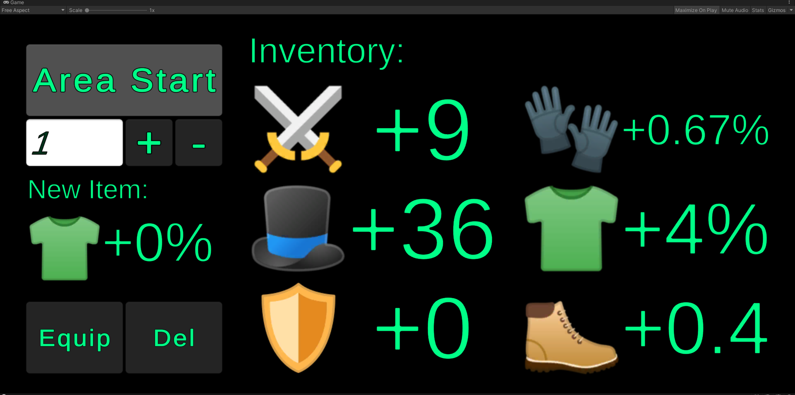
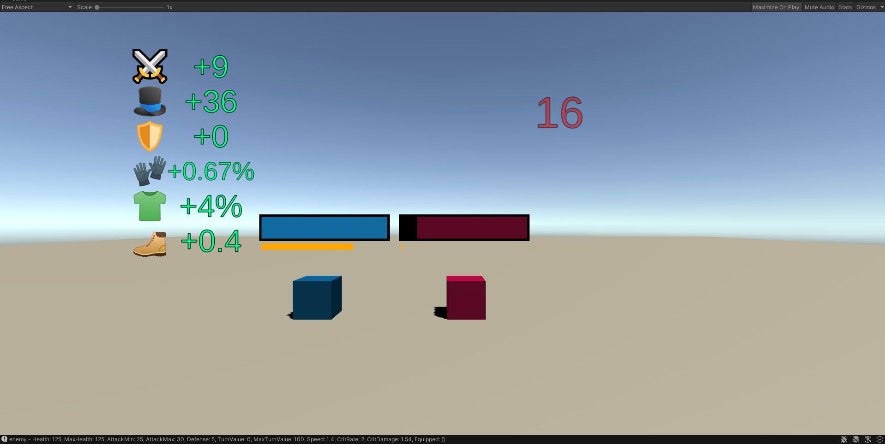
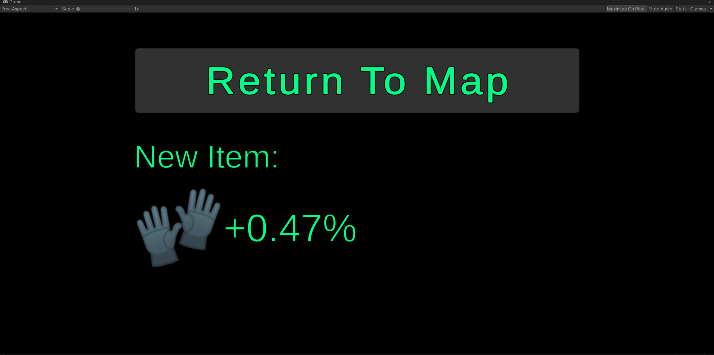
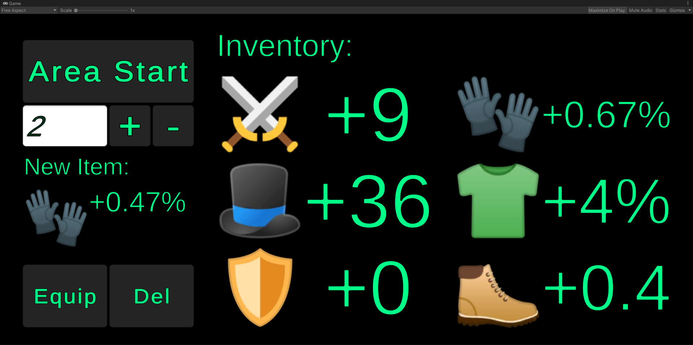
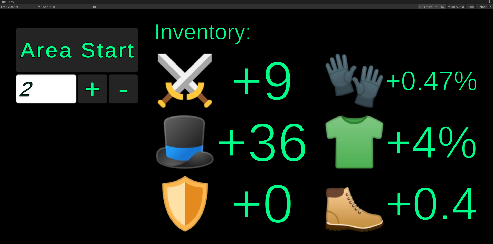

# Overview
An open-source gatcha-styled game, with C# in Unity! When you start up the game, you'll be greeted with the home page:



# Gameplay Explanation
The six traits on the right side of the screen correspond to the six primary traits of the game: 
1. Attack, denoted by the two swords
2. HP, denoted by the hat
3. Defense, denoted by the shield,
4. Crit Rate, denoted by the gloves
5. Crit Chance, denoted by the shirt 
6. Speed, denoted by the boot

The game operates in a level-based fashion:
1. In the top left, the player selects which level/area they would like to enter. The player can use the +/- buttons to navigate up or down. Area 1 is the minimum level that player can enter.
2. Upon entering the area, two cubes spawn! Your cube is the blue one, on the left, and the enemy is the red one, on the right. They'll automatically duke it out, bumping off of one another and damaging each other based on their stats. Your stats will appear next to the blue cube, following it as it moves around. The damage done on each attack is determined by the following code, and the speed of each cube determines how quickly their bar fills up (effectively, how much they get to move):
```c#
public AttackResult Attack(Cube enemy)
{
    AttackResult resultObj = new AttackResult();

    resultObj.isCrit = rand.Next(/*inclusive*/ 0, /*exclusive*/ 101) < CritRate;
    
    int baseAttack = rand.Next(/*inclusive*/ AttackMin, /*exclusive*/ AttackMax);
    foreach (Item item in Equipped)
    {
        if (item.StatType == StatType.ATTACK)
        {
            baseAttack += item.StatIncrease;
        }
    }
    int actualAttack = 
        (int) Math.Floor(resultObj.isCrit ? baseAttack * CritDamage : baseAttack);

    int baseEnemyDefense = enemy.Defense;
    foreach (Item item in Equipped)
    {
        if (item.StatType == StatType.DEFENSE)
        {
            baseEnemyDefense += item.StatIncrease;
        }
    }
    resultObj.enemyDefense = baseEnemyDefense;
    
    resultObj.damageApplied = Math.Max(0, actualAttack - enemy.Defense);
    
    enemy.Health -= resultObj.damageApplied;
    
    resultObj.isEnemyDead = enemy.Health <= 0;

    return resultObj;
}
```



3. Once either one of you dies, one of two things can happen:
    * If you won, then you'll enter a splash page where a random idea, scaled with the level of the stage, will drop! The only option you have is to return to the home page, but on that page you'll be able to equip or delete the new drop, depending on your choice.
    * If you lose, then you'll just return to the home page, with no drop in hand. Bummer!



4. On the homepage, you'll be able equip or delete the item of your choose. Be careful here! You only have one shot at your choice, and your choices are permanent. If you choose to equip the item, it will override your currently equipped item.





# Balance

Unlike classic gatch games, progression is made to be roughly linear! In this way, players aren't forced to endure lengthy, grindy periods of game, and can just experiment and enjoy the game! Hopefully, more developers of this genre can pick up on this sort of trend... someday.